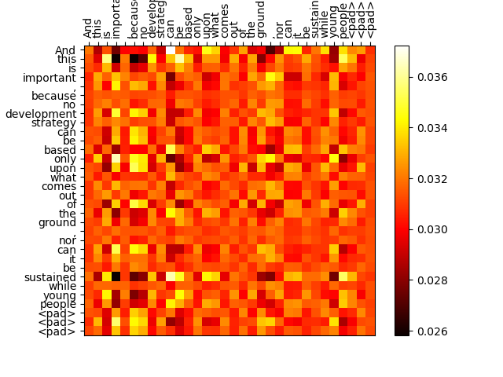
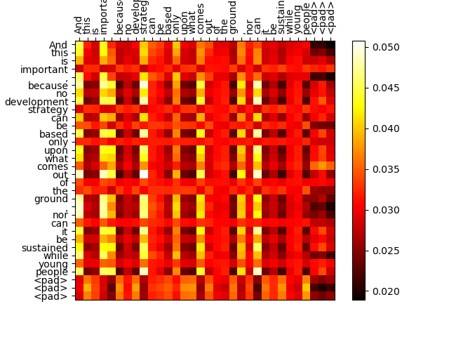
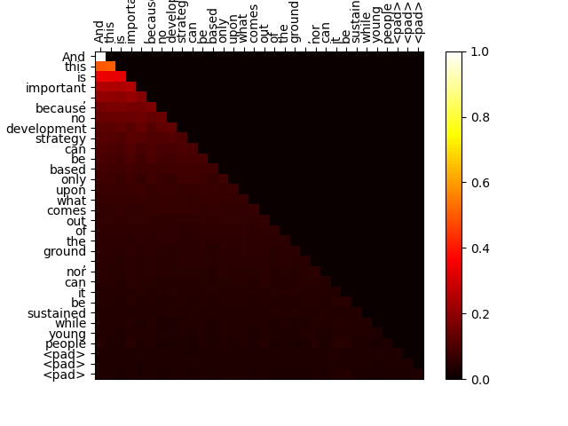
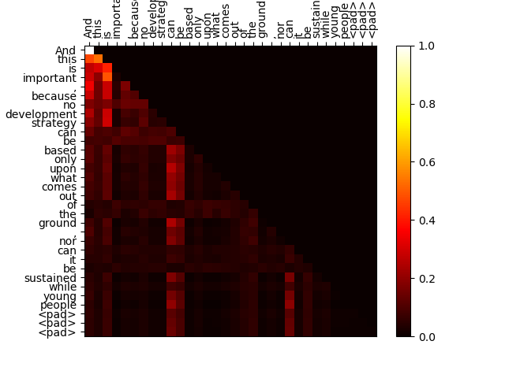

# Programming Assignment 2
##### Connor Gag

# Part 1: Encoder
## Attention Matrices
* For all of the attention maps below, I chose the maps from the last block (for both encoder and decoder). I then chose whichever head from that block had an interesting pattern.
### &nbsp;&nbsp;&nbsp;&nbsp;&nbsp;&nbsp;&nbsp;Before Training &nbsp;&nbsp;&nbsp;&nbsp;&nbsp;&nbsp;&nbsp;&nbsp;&nbsp;&nbsp;&nbsp;&nbsp;&nbsp;&nbsp;&nbsp;&nbsp;&nbsp;&nbsp;&nbsp;&nbsp;&nbsp;&nbsp;After Training

The pretraining attention map is random because it was randomly initialized and has not had the chance to train the attention mechanism. 

For the posttraining attention map, the area with the padding tokens does not have as much attention focused on it because this is not useful information. We can also see a pattern beginning to take shape in this attention map. The model is uniformly putting a lot of focus on specific words such as "And" and "important". It would be difficult to completely understand the goal of this head, but it appears that main words (not filler words) are being focused on here. Other attention maps had different results so the model could keep track of different patterns. 

## Classifier Evaluation
The accuracy of the classification task before training was 33.6% and afterwards was 85.86%. 

## Parameters
My Encoder has 427,600 parameters and my Classifier has 434,403 parameters.

# Part 2: Decoder
## Attention Matrices
### &nbsp;&nbsp;&nbsp;&nbsp;&nbsp;&nbsp;Decoder Before Training&nbsp;&nbsp;&nbsp;&nbsp;&nbsp;&nbsp;&nbsp;&nbsp;&nbsp;&nbsp;&nbsp;&nbsp;&nbsp;&nbsp;Decoder After Training

The attention maps of the decoder before training split up the influence that they recieve to all of the tokens before it. Also note the triangular shape of the map because of the mask.

For posttraining, the model begins to make connections between tokens during training. It is brighter on the top left because there are fewer words to choose from, so the few words that are there have a higher impact. We can also see that some tokens have a high influence on many other words. 

## Parameters
The Decoder has 801,803 parameters.

## Perplexity
### Perplexity Training

The perplexity steadily decreased. It continued to do so after 500 iterations, but at this point the model started to overfit. The final perplexity in my training was always around 130-190. In this case it was 174.91.

### Presidents
Perplexity of obama was 380.94, hbush was 428.83, and wbush was 503.74. The differences in perplexity have to do with how well each president's speech matched the training set. This training set must have had more speeches from Obama (or ones that sound similar) than either of the Bush presidents because it was able to predict the next words in his speech more accurately. 

# Part 3: Architecture Exploration
For my architecture exploration, I tested out different ways to positionally embed the tokens.

I first made changes to some of the hyperparameters of the model, such as the number of heads and adding dropout, which improved the Perplexity on the training and testing set. 

1. Basic
   
The first positional embeddings I added involved storing the embeddings in an nn.Embedding object and allowing the model to learn the best embedding for each position. This is the basic approach used in part 2, which I put here for comparison.

The final Perplexity on the training set was 178.20.
Perplexity of obama is 384.90.
Perplexity of hbush is 440.52.
Perplexity of wbush is 504.66.

2. Sinusoidal
   
The first new technique I used was the Sin/Cos approach expressed in the "Attention is All You Need" paper.

The final Perplexity on the training set was 138.56.
Perplexity of obama is 351.79.
Perplexity of hbush is 390.75.
Perplexity of wbush is 478.02.

3. ALiBi
   
The last approach I used was ALiBi, which doesn't use positional embeddings directly, but adds positional information to the attention matrix in the Head class.

The final perplexity was 112.86.
Perplexity of obama is 337.00.
Perplexity of hbush is 375.36.
Perplexity of wbush is 457.92.

## Findings
Using the Sin/Cos functions described in the "Attention is All You Need" paper did consistently improve the model results. Our block_size was only 32, but I suspect that this positional embedding technique would perform well under larger block sizes. 

I was surprised that ALiBi performed as well as it did, despite not having any initial absolute positional embeddings. There are more parameters you can set with ALiBi, such as m, which is a mutliplier for the matrix. I set it at one, but in future versions I would experiment with different values. 

# Sources Used
- The youtube video by Andrej Karpathy: [Let's build GPT: from scratch, in code, spelled out.](https://www.youtube.com/watch?v=kCc8FmEb1nY)
- Lecture 8 in class. I followed along with the Demo for the encoder.
- "Attention is All You Need" paper, Vaswani et al. I followed this paper for the architecture. 
- [ALiBi: Attention with Linear Biases](https://medium.com/@pajakamy/alibi-attention-with-linear-biases-942abe042e9f). I used this article to understand and write ALiBi.
- To learn Sin/Cos Positional Embeddings [A Gentle Introduction to Positional Encodings](https://machinelearningmastery.com/a-gentle-introduction-to-positional-encoding-in-transformer-models-part-1/).
